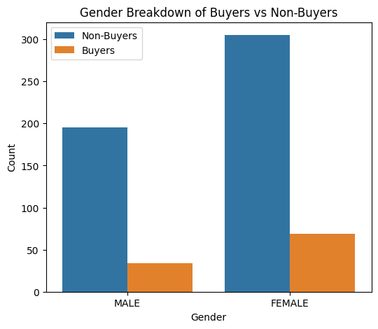

# Predicting Customer Purchases to Increase Sales Revenue of a Low-Performing Product

---

## Overview
This project aims to predict customer purchases to increase sales revenue of a low-performing product.

---

## Data Used
- **[week8_student_project.csv.gz](https://drive.google.com/file/d/1mEZBg2X8ZA33ulqEApWkZxXSH2FA_BkU/view?usp=drive_link)** - This is the dataset used for building the ML model.

---

## Objective and Scope

- **Objective**:
  - To create a machine learning model that predicts whether a customer will purchase Product 6850 in January 2019 with an accuracy above 85% and a recall of at least 70%.

- **Hypothesis**:
  - Customer Demographics Impact Buying Behavior - Customers of a certain age group, gender, or membership type are more likely to buy Product 6850.
  - Past Purchase History Predicts Future Purchases - Customers who have purchased gadgets or similar product categories in the past 3 months are more likely to buy Product 6850.
  - Weather Conditions Affect Purchase Decisions - Sales of Product 6850 are higher on cloudy/rainy days and lower on sunny days.
  - Frequent Shoppers are More Likely to Buy - Customers with higher overall spending and transaction frequency have a higher chance of buying Product 6850.

---

## Descriptive Statistics Summary

|            | quantity | amount  | temperature_list | realfell_list | target |
|------------|----------|---------|------------------|----------------|--------|
| **count**  | 603.000  | 603.000 | 603.000          | 603.000        | 603.000|
| **mean**   | 10.187   | 4586.733| 26.295           | 30.295         | 0.170  |
| **std**    | 5.431    | 2687.647| 5.248            | 5.248          | 0.377  |
| **min**    | 1.000    | 100.000 | 18.000           | 22.000         | 0.000  |
| **25%**    | 5.500    | 2800.000| 22.000           | 26.000         | 0.000  |
| **50%**    | 10.000   | 3700.000| 27.000           | 31.000         | 0.000  |
| **75%**    | 15.000   | 6800.000| 31.000           | 35.000         | 0.000  |
| **max**    | 19.000   | 9900.000| 35.000           | 39.000         | 1.000  |

### Takeaways from the Descriptive Statistics:
- Identified patterns in customer spending behavior and weather trends.
- Top features influencing purchases include **age**, **quantity**, **amount spent**, and **weather conditions**.
- These statistics were crucial for **data validation before model training**.

---

## 📊 Visualizations

Below are some key exploratory data analysis visuals that helped understand buyer behavior and feature relationships:

- **Age Distribution of Buyers vs Non-Buyers**
  - Specific age groups dominate purchases.
  - Older demographics (45–60 years) buy more gadgets.
  - This would help refine marketing strategies.

- **Transaction Amount Comparison**
  - Buyers spend consistent amounts, indicating budget preference.
  - Non-buyers have higher variance in spending.
  - This helps in customer segmentation for targeted promotions.

- **Gender Comparison**
  - Female buyers slightly outnumber male buyers for Product 6850.
  - Gender-based targeting may improve marketing effectiveness.
  - This supports personalized recommendation strategies.

- **Impact of Weather on Buying Behavior**
  - Trend: Cloudy/rainy days boost gadget sales.
  - Hypothesis Validated: Weather affects consumer decisions.
  - Seasonal promotions could improve sales.

- **Model Performance Confusion Matrix**
  - Low false negatives, high true positives.
  - Outcome: Model performs well in identifying potential buyers.

---

## 🧠 Model Performance Summary

### Final Evaluation Metrics:
- **ROC-AUC Score**: `0.9923`
- **Accuracy**: `0.9841`
- **Precision**: `0.9000`
- **Recall**: `1.0000`

### Prediction Breakdown:

| target | prediction | count |
|--------|------------|-------|
|   1    |     1.0    |  18   |
|   0    |     0.0    | 106   |
|   0    |     1.0    |   2   |

📌 **Insights**:
- The model **perfectly identifies buyers** (100% recall).
- Only **2 false positives**, meaning it's **highly precise**.
- Ideal for **targeted marketing campaigns** where missing buyers is costly.

---

## Final Project File

- **[Project](https://github.com/ludreinsalvador/gadgets_product_6850_project/blob/main/gadgets_product_6850_project.ipynb)** – Contains the Jupyter notebook for data analysis and model building.

---

## Takeaways
- The model achieved high accuracy, making it effective for customer targeting.
- **Business Impact** - Helps improve sales by predicting high-potential buyers.

---

## Future Improvements
- Deploy the model in real-time recommendations.
- Monitor predictions and retrain with new data for continuous improvement.
- Use insights for personalized marketing strategies.
